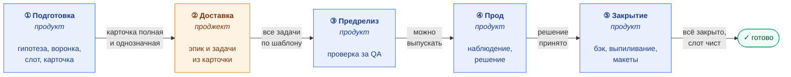
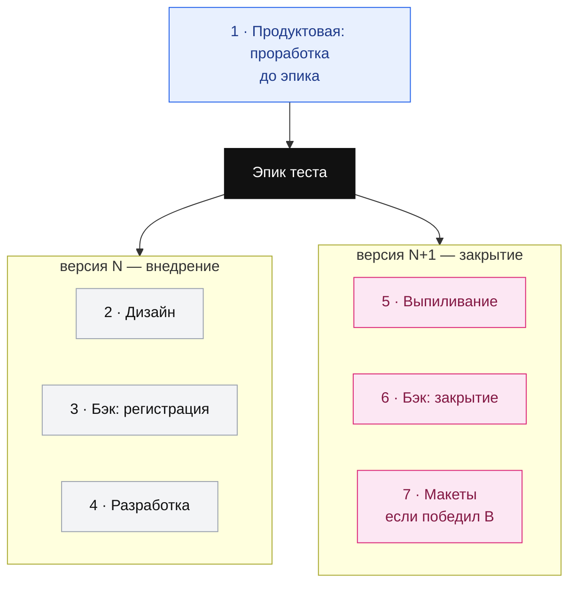

# Жизненный цикл A/B-теста

## Фазы и владельцы

Пять фаз. Владелец меняется дважды: продукт-менеджер → проджект-менеджер →
продукт-менеджер. Подпись на стрелке — условие перехода: пока оно не
выполнено, дальше нельзя.

**Карточка в Notion** — точка передачи между продуктом и проджектом.
Продукт довёл её до полной и однозначной, проджект берёт как есть.
Ошибка в карточке унаследуется всеми задачами.

**Слот чист** — в Plausible по этому слоту больше не приходят данные
закрытого теста: он остановлен на бэке и удалён из кода приложения.
Пока это не так, следующий тест на этом слоте получит чужие данные.

## Семь задач в одном эпике

Эпик один на весь тест. Версии у задач разные: доставка — в версии
внедрения, закрытие — в следующей.

| # | Задача | Кто создаёт | Когда |
| - | ------ | ----------- | ----- |
| 1 | Продуктовая: проработка | ab-test-prepare | появилась гипотеза |
| 2 | Дизайн | release-epic-sync | планирование релиза |
| 3 | Бэк: регистрация | release-epic-sync | планирование релиза |
| 4 | Разработка | release-epic-sync | планирование релиза |
| 5 | Выпиливание | release-epic-sync | планирование релиза, версия N+1 |
| 6 | Бэк: закрытие | ab-test-close | решение по тесту |
| 7 | Макеты | ab-test-close | решение по тесту, только если победил B |

## Аудит

`ab-test-audit` работает поверх фаз ③–⑤ и только читает. Три проверки:
все ли семь задач на месте, не противоречат ли они друг другу и карточке,
не сидят ли в одном слоте два теста в проде.
