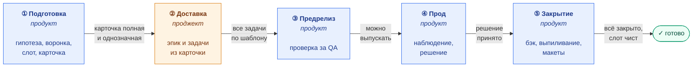

# Предложение: воркфлоу жизненного цикла A/B-теста

## Что работает и что нет

`release-epic-sync` хорошо решает доставку: находит проект, версию, компонент,
создаёт эпики и связывает их с Notion. Для карточек с меткой `A/B testing`
он заводит платформенную задачу, бэк-задачу и задачу на телеметрию.

Проблемы начинаются с содержанием. Воркфлоу переносит в Jira то, что лежит
в карточке, но у A/B-теста есть параметры, которые в карточке обычно
отсутствуют, а ошибка в них ломает тест целиком:

| Параметр | Где сейчас | Что происходит |
| --- | --- | --- |
| `experiment_name` | пустое поле в бэк-задаче, «заполнить» красным | вписывают позже комментарием |
| слот `experiment_1/2/3` | нигде | разработка выбирает сама |
| названия веток `-a_def` / `-b` | свободный текст | ошибки в суффиксе |
| продуктовая задача на проработку | нет | работа PM не видна в Jira |
| закрытие теста на бэке и выпиливание | нет | никто не заводит |
| обновление макетов после победы B | нет | в Figma остаются тестовые ветки |

## Термины

- **Продукт** — продукт-менеджер, **проджект** — проджект-менеджер.
- **Слот** — один из трёх каналов данных в Plausible: `experiment_1`,
  `experiment_2`, `experiment_3`. Тест передаёт в свой слот название ветки,
  которую видит пользователь. Два теста в одном слоте портят друг другу
  статистику.
- **Хвост** — пользователи старых версий приложения, которые продолжают
  отправлять данные закрытого теста, пока его код не удалён из клиента.
  Слот с хвостом — **грязный**: новый тест на нём получит чужие данные.
- **N и N+1** — версия, в которой тест внедряется, и следующая за ней.
- **slug** — короткое имя теста латиницей через дефис, часть
  `experiment_name`: в `AG-58893-onboarding-paid-features` это
  `onboarding-paid-features`. Ключ в префиксе — продуктовой задачи,
  она создаётся первой.
- **release-epic-sync** — существующий воркфлоу, который после планирования
  релиза создаёт эпики и задачи в Jira из карточек Notion.
- **ab-test-prepare, ab-test-audit, ab-test-close** — три новых воркфлоу,
  описаны в конце документа.

## Три факта из проды

**AG-57632.** `experiment_name` и слот появились в задаче комментарием
`UPD: 3` и `UPD: 4` через две недели после постановки. Понадобился коммит
`19ad667 — use backend experiment name and slot 3`. В проде до сих пор летит
`AG-57632-home-basic-level` в слот 1 вместо третьего.

**AG-51010.** Закрыт на бэке 29 апреля (ADG-12170). Задачи на выпиливание
нет. Четыре месяца спустя его хвост сидит в Extension `experiment_1` вместе
с идущим `AG-52740-rule-limits` — 372 тысячи участников вперемешку.

**Android.** Два слота из трёх содержат по два эксперимента одновременно.

Ни один из этих случаев `release-epic-sync` не мог ни предотвратить,
ни заметить: слотов он не знает, в Plausible не ходит, задач конца цикла
не заводит.

## Предложение: пять фаз, у каждой один владелец

Разделение не по типам задач, а по тому, **кто владеет процессом и что
передаёт дальше**. Владелец меняется дважды: продукт → проджект → продукт.

Подпись на стрелке — условие перехода: пока оно не выполнено, дальше нельзя.
Какой воркфлоу работает в какой фазе — в таблице в конце раздела.

`release-epic-sync` остаётся как есть и владеет ровно одной фазой —
доставкой. Всё до и после — продуктовые воркфлоу.

### Фаза 1. Подготовка — владелец продукт

Продукт-менеджер заходит в цикл с одной целью: **полностью заполнить
карточку в Research Board**. Его ответственность заканчивается в момент,
когда карточка насыщена всеми обязательными полями и воркфлоу это подтвердил.

Воркфлоу `ab-test-prepare` заводит продуктовую задачу, собирает данные,
заполняет карточку — и **на выходе проверяет её полноту**. Пока проверка
не пройдена, фаза не закрыта и карточка не передаётся дальше.

### Точка передачи: карточка как артефакт

После проверки карточка становится **артефактом проджект-менеджера**.
Он берёт её в фазу доставки и не должен ничего в ней додумывать.

Это ключевое место всей схемы. Доставка генерирует эпик и семь задач
**из содержимого карточки**. Если в карточке ошибка, неоднозначность или
пропуск — все задачи унаследуют их, и разработка сделает не то. Поэтому
проверка на выходе из подготовки — это проверка не только полноты,
но и **однозначности**:

| Что проверяется | Пример провала |
| --------------- | -------------- |
| поле заполнено | слот не указан |
| поле однозначно | две основные метрики вместо одной |
| поле читается без контекста | «вариант B — как обсуждали» вместо описания |
| поля не противоречат друг другу | baseline 1,6% при известном баге в измерении |
| значения в правильном формате | `experiment_name` без ключа задачи, ветка `-a` вместо `-a_def` |

Обязательные поля для передачи:

- название теста и `experiment_name` — проверенный на уникальность
  по базе прошлых тестов; бэк не примет повтор
- платформа и слот — проверенный, свободный и чистый
- гипотеза в формате «если X, то Y, потому что Z»
- одна основная метрика, guardrail-метрики
- baseline с указанием периода и источника
- размер выборки и плановая длительность
- обе ветки: что видит control, что видит B — так, чтобы дизайнер и
  разработчик поняли без вопросов
- план по исходам: что делаем при победе, поражении, отсутствии разницы
- версия, в которой тест релизится — заполняет PM, — и ограничения:
  что должно выйти до теста
- события телеметрии, которые нужны для измерения

Если чего-то нет — воркфлоу не «отмечает как ограничение», а возвращает
карточку продукту с перечнем пропусков.

### Фаза 2. Доставка — владелец проджект

`release-epic-sync` в текущем виде плюс правки из следующего раздела.
Создаёт эпик и задачи строго по шаблонам, заполняя их из карточки. На выходе:
все задачи заведены, на правильную версию, в правильных проектах, с правильным
содержанием. Владение возвращается продукту.

### Фаза 3. Предрелиз — владелец продукт

Фаза, которой сейчас нет ни в одном воркфлоу. Задачи закрыты, сборка есть,
но тест ещё не выпущен на аудиторию.

Продукт-менеджер **перепроверяет за QA**, что тест действительно готов:
`experiment_name` и слот в сборке совпадают с карточкой, события летят
в Plausible с правильным `version_name`, обе ветки воспроизводятся,
дефолт при ошибке работает. Это последняя точка, где ошибку ещё можно
поймать до релиза — а kill switch отсутствует.

Формально: после доставки, до выхода в прод. Как её обозначать и кто
ставит финальное «можно выпускать» — обсудить отдельно.

### Фаза 4. Прод — владелец продукт

Тест идёт. Продукт-менеджер наблюдает: данные приходят, распределение
не перекошено, guardrail-метрики не проседают, слот не загрязнён соседом.
`ab-test-audit` показывает это по всем тестам разом. Фаза заканчивается
принятием решения.

### Фаза 5. Закрытие — владелец продукт

Решение принято. Продукт-менеджер должен убедиться, что **все задачи эпика
действительно закрыты**: бэк-закрытие, выпиливание, обновление макетов
если победил B. Только после этого тест считается завершённым, а слот —
чистым.

Здесь больше всего открытых вопросов — детали обсуждаются отдельно.

### Воркфлоу по фазам

| Фаза | Воркфлоу | Что делает |
| ---- | -------- | ---------- |
| ① Подготовка | ab-test-prepare | заполняет карточку, проверяет её полноту |
| ② Доставка | release-epic-sync | создаёт эпик и задачи из карточки |
| ③ Предрелиз | ab-test-audit | сверяет задачи с карточкой |
| ④ Прод | ab-test-audit | следит за слотами и данными |
| ⑤ Закрытие | ab-test-close, ab-test-audit | создаёт задачи закрытия, проверяет, что всё закрыто |

## Точечные правки в release-epic-sync

Семь изменений в Phase 9 (раздел про A/B-тесты), все локальные:

1. **Брать `experiment_name` из карточки, а не оставлять пустым.** Имя
   формируется на этапе подготовки — из ключа продуктовой задачи и slug,
   например `AG-58893-onboarding-paid-features`, — и проверяется на
   уникальность по базе прошлых тестов. К моменту доставки оно уже
   в карточке. Воркфлоу копирует его в платформенную и бэк-задачу дословно.
   Если в карточке имени нет — карточка не готова, задачи не создаются.

2. **Подставлять названия веток** из `experiment_name`:
   `<experiment_name>-a_def` для контроля, `<experiment_name>-b` для варианта.
   Это две строки, ошибиться в них не должно быть возможности.

3. **Переносить слот из карточки.** Добавить в карточку Notion поле
   `Слот`, воркфлоу читает его и вписывает в платформенную и бэк-задачу.
   Проверить занятость он не сможет — для этого нужен Plausible, — но
   перестанет терять уже принятое решение.

4. **Не создавать A/B-задачи из неполной карточки.** Карточка приходит
   в доставку как артефакт подготовки, и там уже проверена. Но доставка
   должна перепроверить сама: если нет `experiment_name`, слота, веток,
   основной метрики или размера выборки — не создавать задачи, а вывести
   карточку в `Skipped` с перечнем пропусков. Задачи, созданные из неполной
   карточки, унаследуют пропуски, и чинить их придётся уже в Jira.

5. **Создавать бэк-задачу сразу в ADG с компонентом BackendJava.** Сейчас
   она заводится как `Product` с компонентом `Product` и строкой «перевести
   на бекенд» в описании. ADG-12912, который реально работал, создан сразу
   в ADG. Ручной перенос — лишний шаг, который теряется; у бэк-задачи один
   тип и один компонент, и они известны заранее.

6. **Заводить задачу на выпиливание вместе с dev-задачей.** В том же
   эпике, с меткой `cleanup` и `Fix Version` = N+1 — следующий релиз после
   версии внедрения. Всё для неё известно в момент создания dev-задачи.
   Подробнее — в разделе про размещение задач.

7. **Телеметрия — блок в описании dev-задачи, а не отдельная задача.**
   Убрать `prepare and hand over Telemetry events / Accessibility` как
   отдельную Product-задачу. Вместо неё в dev-задаче — обязательный блок:
   какие события добавить, `experiment_*` в событиях, проверка в Plausible.
   Входит в Definition of Done, «сделать потом» не получится.

## Шаблоны задач: строго по образцу, с обязательными полями

Главное требование к любому воркфлоу, который заводит задачи A/B-теста:
**задача создаётся только по шаблону, и только если заполнены все
обязательные поля**. Пустое обязательное поле — не «заполнить потом»,
а причина не создавать задачу и вывести её в `Skipped` с указанием,
чего не хватает.

Семь типов задач в порядке жизненного цикла. У каждого свой шаблон,
свободный текст в описании не допускается: содержимое собирается из полей
карточки и подстановок.

### 1. Продуктовая: проработка теста

`Проработать A/B-тест «<название>»` · тип Product · компонент Product: AdBlocker

Самая первая задача. Здесь появляется гипотеза, считается выборка,
заполняется карточка в Research Board.

| Поле | Откуда | Обязательно |
| ---- | ------ | ----------- |
| платформа и тема | вход воркфлоу подготовки | да |
| ссылка на карточку в Research Board | появляется по итогу проработки | при закрытии задачи |
| Assignee | PM, который запустил | да |
| Due Date | создание + 5 дней | да |
| Definition of Done | карточка заполнена: гипотеза, метрика, baseline, выборка, слот, ветки, план по исходам | да |

Создаётся воркфлоу подготовки в самом начале, чтобы работа PM была видна
в Jira. Закрывается PM, когда карточка готова к релизному планированию.

### 2. Дизайн

`<Название> [A/B тест]` · тип Design · метка Split-Testing

| Поле | Откуда | Обязательно |
| ---- | ------ | ----------- |
| проблема и гипотеза | из карточки | да |
| ссылка «Карточка в Research» | URL карточки | да |
| описание веток: что видит control, что видит B | из карточки | да |
| к кому обратиться | Product manager карточки | да |
| кого позвать на ревью | из карточки, если указано | нет |
| связь `blocks` → dev-задача | автоматически | да |

Ссылка на карточку — обязательное поле, а не «если есть». По ней
аудит потом находит карточку, когда прямой поиск не срабатывает.

### 3. Бэк: регистрация теста

`Add information about Test <AG-XXXXX> to the service` · проект ADG ·
компонент BackendJava

| Поле | Откуда | Обязательно |
| ---- | ------ | ----------- |
| `experiment_name` | из карточки дословно | да |
| ветки | `<experiment_name>-a_def`, `<experiment_name>-b` — из карточки | да |
| слот | из карточки | да |
| суть теста, цель | из карточки | да |
| продукт, платформа | из карточки релиза | да |
| связь `blocks` → dev-задача | автоматически | да |

Создаётся сразу в ADG, без промежуточного `Product` и ручного переноса.

### 4. Разработка

`Implement <что> for A/B test — «<название>»` · проект AG ·
компонент платформы · метка Split-Testing

| Поле | Откуда | Обязательно |
| ---- | ------ | ----------- |
| блок «Параметры эксперимента» | `experiment_name`, слот, обе ветки — из бэк-задачи | да |
| проблема | из карточки | да |
| ToDo dev | из карточки: что меняем | да |
| **блок «Телеметрия»**: события, `experiment_*` в событиях, проверка в Plausible | из карточки, в том же описании | да |
| ссылка на PR | поле `implemented by`, заполняется при открытии PR | при переводе в Code Review |
| Definition of Done | шаблон: PR аппрувнули QA, помержен, имя и слот совпадают с бэком, `experiment_*` приходит в Plausible | да |
| связи `is blocked by` → дизайн и бэк-регистрация, `relates to` → выпиливание | автоматически | да |

Два отличия от текущего `release-epic-sync`:

- **Телеметрия — блок в описании dev-задачи, а не отдельная Product-задача.**
  Сейчас она заводится как `prepare and hand over Telemetry events /
  Accessibility … если требуется` и живёт отдельно от кода. В результате
  на экранах онбординга Mac Mini размечен только `pageview`, событий
  действий нет, и измерить поведение там нельзя. Когда события перечислены
  в той же задаче, что и код, их нельзя «сделать потом» — они часть
  Definition of Done.
- **Блок параметров заполнен при создании**, а не «заполнить красным».
  Всё, что в нём стоит, уже известно: ключ задачи выдан, slug выведен
  из названия, слот взят из карточки.

### 5. Выпиливание из клиента

`Выпилить A/B-тест <AG-XXXXX> — «<название>»` · проект AG ·
метки Split-Testing, cleanup

| Поле | Откуда | Обязательно |
| ---- | ------ | ----------- |
| `experiment_name`, слот | из dev-задачи | да |
| победивший вариант | из воркфлоу закрытия | при закрытии |
| `Fix Version` | N+1 — следующий релиз | при создании |
| связь `relates to` → dev-задача и бэк-закрытие | автоматически | да |

Создаётся **вместе с dev-задачей**, в том же эпике, с `Fix Version` = N+1.
Так задача не теряется, видна в планировании следующего релиза с первого
дня, а история теста остаётся в одном эпике.

### 6. Бэк: закрытие теста

`Close Test <AG-XXXXX> in the service` · проект ADG · компонент BackendJava

| Поле | Откуда | Обязательно |
| ---- | ------ | ----------- |
| `experiment_name` | из регистрационной задачи | да |
| ветки | из регистрационной задачи | да |
| победившая ветка | вход воркфлоу закрытия | да |
| связь `relates to` → dev-задача и задача на выпиливание | автоматически | да |

Заводится воркфлоу закрытия, не релизным. Без победившей ветки не создаётся.

### 7. Дизайн: обновление макетов

`Обновить макеты по итогам A/B-теста <AG-XXXXX>` · тип Design ·
метка Split-Testing

Условная задача: создаётся **только если победил тестовый вариант**.
Если победил контроль — макеты менять не нужно, задача не заводится.

| Поле | Откуда | Обязательно |
| ---- | ------ | ----------- |
| ссылка на карточку и на исходную дизайн-задачу | из dev-задачи по связям | да |
| победивший вариант и что в нём | из воркфлоу закрытия | да |
| Assignee | тот же дизайнер, что делал исходную задачу | да |
| связь `relates to` → dev-задача, исходная дизайн-задача | автоматически | да |

Без неё макеты в Figma остаются с тестовыми ветками, а следующий дизайнер
не понимает, какая из них теперь основная.

### Принцип для всех семи

Воркфлоу не спрашивает «заполнить?» и не оставляет пустых мест. Если поле
обязательное и его неоткуда взять — задача не создаётся, а в отчёте
появляется строка: какая задача, какое поле, откуда его ждали. Это
единственный способ гарантировать, что имя и слот не приедут комментарием
через две недели.

## Куда положить задачи, которых сейчас никто не создаёт

Продуктовая на проработку, выпиливание, закрытие на бэке, обновление
макетов — четыре задачи, у которых нет создателя. Продуктовая и макеты
описаны в шаблонах выше и создаются воркфлоу подготовки и закрытия.
Ниже — про две, которые требуют отдельного решения, где им жить.

### Один эпик на весь тест, версии — по фазам

Задача на выпиливание — часть эпика A/B-теста. Отделять её или заводить
второй эпик на следующую версию — плохо: история теста размазывается.
Но она и не относится к версии, где тест внедряется.

Решение: **эпик один, а версии у задач разные**.

| Задачи | Fix Version | Когда ставится |
| ------ | ----------- | -------------- |
| дизайн, бэк-регистрация, разработка | N — версия внедрения | при создании |
| выпиливание, бэк-закрытие, макеты | N+1 — следующий релиз | при создании |

Задачи закрытия сразу назначаются на следующий релиз, а не остаются без
версии. Так они видны в планировании N+1 с первого дня, а эпик хранит
всю историю теста в одном месте.

**Эпик после имплементации.** Когда задачи фазы доставки закрыты и тест
уехал в версию N, эпик не закрывается — в нём ещё живут задачи на N+1.
Два допустимых варианта, выбрать один:

- перевести эпик в `Done` по готовности имплементации, задачи N+1
  остаются внутри и закрываются своим чередом
- сменить `Fix Version` эпика на N+1, чтобы он двигался вместе
  с оставшимися задачами

Второй вариант точнее отражает состояние: эпик открыт, пока тест не
завершён целиком.

### Выпиливание — в release-epic-sync, рядом с dev-задачей

Всё, что нужно для задачи на выпиливание, известно в момент создания
dev-задачи: `experiment_name`, слот, платформа, ключ dev-задачи.

Предложение: шестая правка в Phase 9 — сразу после dev-задачи создаётся
`Выпилить A/B-тест <AG-XXXXX> — «<название>»`:

- проект AG, метки `Split-Testing` и `cleanup`
- Epic Link — тот же эпик, что у dev-задачи
- **Fix Version — N+1**, следующий релиз после версии внедрения
- связь `relates to` → dev-задача

Аудит проверяет, что она есть, а при закрытии
в неё проставляется победивший вариант.

### Закрытие на бэке — отдельный воркфлоу, по факту решения

`Close Test` нельзя создать заранее: в нём обязательна победившая ветка,
а она известна только после анализа. Создавать с пустым полем — значит
нарушить принцип «без обязательных полей не создаём».

Предложение: воркфлоу `ab-test-close` с двумя входами — ключ dev-задачи
и победившая ветка (`a_def` или `b`). Запускается PM в момент решения.
Делает четыре вещи:

1. Создаёт `Close Test <AG-XXXXX> in the service` в ADG, компонент
   BackendJava, с `experiment_name` и ветками из регистрационной задачи
   и победителем из входа. Связь `relates to` → dev-задача и выпиливание.
2. Проставляет в задачу на выпиливание победивший вариант. Версия там
   уже стоит с момента создания.
3. Если победил тестовый вариант — создаёт дизайн-задачу на обновление
   макетов, на того же дизайнера, что делал исходную. Если победил
   контроль — не создаёт.
4. Дописывает в карточку Notion результат: победитель, дата решения, ссылки
   на все задачи закрытия.

Триггер ручной, но воркфлоу гарантирует, что задачи закрытия появятся
вместе и будут связаны. А `ab-test-audit` ловит случай, когда PM забыл его
запустить: dev-задача закрыта, версия вышла, а `Close Test` нет —
это критичная находка.

### Итого по жизненному циклу задач

| Задача | Кто создаёт | Когда |
| ------ | ----------- | ----- |
| продуктовая: проработка | ab-test-prepare | появилась гипотеза |
| дизайн | release-epic-sync | планирование релиза |
| бэк: регистрация | release-epic-sync | планирование релиза |
| разработка | release-epic-sync | планирование релиза |
| выпиливание | release-epic-sync, версия N+1 | планирование релиза |
| бэк: закрытие | ab-test-close | решение по тесту |
| дизайн: обновление макетов | ab-test-close, если победил B | решение по тесту |

Четыре из семи — в одном прогоне существующего воркфлоу. Первая — там,
где начинается работа PM. Две последние — там, где появляется их
обязательное поле: победившая ветка.

## Новые воркфлоу

### ab-test-prepare — подготовка карточки

Вход: тема и платформа. Первым делом заводит продуктовую задачу
«Проработать A/B-тест» на PM — чтобы работа была видна в Jira. Затем
собирает воронку из Plausible, находит пробелы разметки, проверяет свободные
и чистые слоты, предлагает `experiment_name` из ключа продуктовой задачи
и проверяет, что такого имени ещё не было, заполняет карточку
в Research Board и дописывает ссылку на неё в задачу. Спрашивает у PM
только то, чего нет в данных.

**На выходе — проверка карточки на полноту и однозначность** по списку
из раздела «Точка передачи». Пока проверка не пройдена, фаза не закрыта:
воркфлоу возвращает перечень пропусков, а не отмечает их как ограничения.
Только после этого карточка передаётся проджекту.

### ab-test-audit — противоречия между задачами, карточкой и продом

Вход: ничего. По каждому тесту собирает **все семь задач** и карточку
Notion, добавляет живые данные слотов из Plausible — и сверяет их между
собой. Только чтение. Подходит для периодического джоба.

Три уровня проверки:

**Комплектность.** Какие из семи задач существуют, какие должны существовать
на текущей стадии, а каких нет. Продуктовая без ссылки на карточку,
dev без выпиливания, закрытие на бэке без задачи на макеты при победе B.

**Согласованность содержимого.** Одни и те же значения должны совпадать
символ в символ во всех задачах, где они встречаются:

| Значение | Где должно совпадать |
| -------- | -------------------- |
| `experiment_name` | карточка, бэк-регистрация, dev, бэк-закрытие, выпиливание |
| слот | dev, бэк-регистрация, карточка |
| ветки `-a_def` / `-b` | бэк-регистрация, dev, бэк-закрытие |
| победившая ветка | бэк-закрытие, выпиливание, обновление макетов |
| ссылка на карточку | продуктовая, дизайн, dev, обновление макетов |

Расхождение в любом из них — критичная находка: оно означает, что задачи
описывают разные тесты, и разработка сделает по одной из версий.

**Структура.** Задачи в правильных проектах и с правильными типами
(бэк — в ADG с BackendJava, дизайн — тип Design), связаны нужными
связями (`blocks`, `is blocked by`, `relates to`), не дублируются.

Поверх этого — сверка с продом: имя и слот в Plausible совпадают с задачами,
в слоте нет второго эксперимента, закрытый тест не продолжает слать данные.

Работает в трёх фазах: в предрелизе показывает, совпадают ли имя и слот
в задачах с карточкой; в проде — не загрязнён ли слот и идут ли данные;
в закрытии — закрыты ли все задачи эпика и чист ли слот после них.

### ab-test-close — закрытие теста

Вход: ключ dev-задачи и победившая ветка. Заводит `Close Test <key> in the
service` в ADG, проставляет версию и победителя в уже существующую задачу
на выпиливание, при победе B создаёт дизайн-задачу на обновление макетов,
дописывает результат в карточку. Подробнее — в разделе выше.

Детали фазы закрытия — что считать завершённым тестом и как это
проверять — обсуждаются отдельно.

## Что уже есть

Логика всех трёх воркфлоу написана и обкатана локально: правила именования,
чек-лист гейтов по шагам процесса, семь заполненных примеров задач в порядке
цикла, QA-сценарии, скрипт сверки слотов с Plausible, дашборд с проверками
по каждому тесту. Черновик `ab-test-audit` в формате
репозитория приложен — с него проще начать, потому что он ничего не создаёт.
Схема процесса для обсуждения — в `PROCESS-DIAGRAM.md`.
